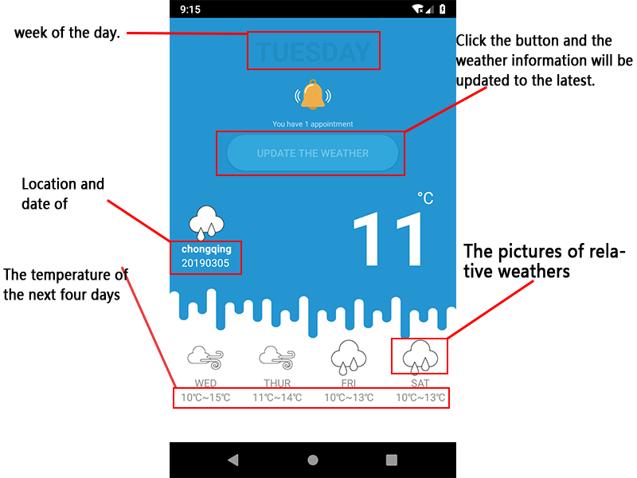
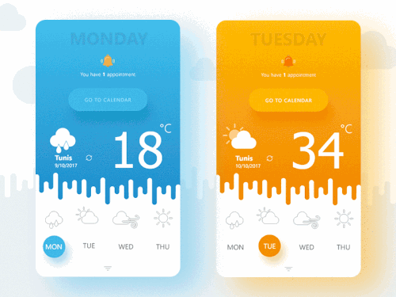
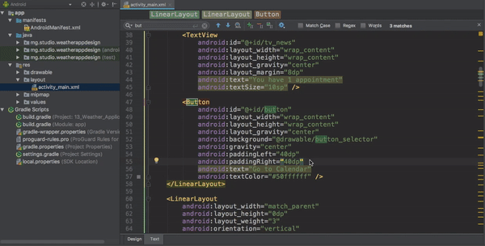
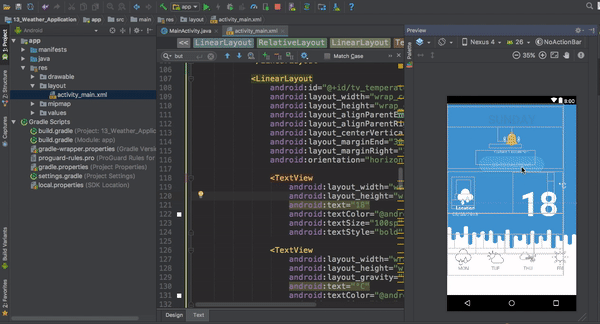
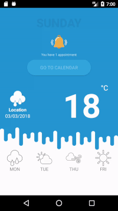
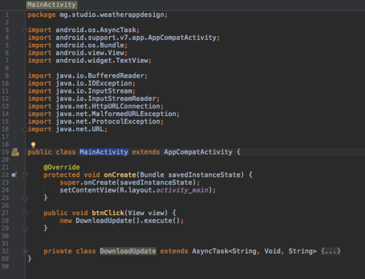

# Weather forecast application



As the project is updated based on the project of dragona and added some functions, I will explain how to implement the update about the update part.
If we need to specify what we will be doing, here is the list:
该应用是在原有项目的基础上添加了部分功能实现的，我在这里主要说明一下我所更新得部分得实现。
+将我们今天的任务稍微细分一下，主要包括以下这些:

- [Designing the application in Android Studio (前端：在android studio中设计这个应用的界面)](#designing-the-application-in-android-studio)
- [Connecting the application to the Internet and updating the content based on the weather forecast (后端：将应用连上网络并依据天气预报信息对内容进行更新)](#connecting-the-application-to-the-internet-and-updating-the-content-based-on-the-weather-forecast)


# Designing the application in Android Studio
# 前端：在android studio中设计这个应用的界面

I have not change the main design of UI and what I only do is to add TextViews below the icons to show the temperatures of the next four days.
对于整体界面我没有做任何改动，仅仅是在图标的下面添加了TextView来展示接下来四天的温度。



To check whether everything is working properly, I always run my application for testing on my virtual devices.

为了保证一切正常，设计完毕后，我在虚拟机上进行了测试：

My AVD specication is: 

我使用的虚拟设备规格如下: 

- Device name (设备名): Custom Phone of Genymotion
- Height (高度): 1280
- Width (宽度): 720
- API level (API等级): 28

I will do most of the design work in the 'activity_main.xml' which is located inside the 'res/layout' folder. Currently, below is what I have updated.

我们的设计工作将会主要在'activity_main.xml'文件中完整，该文件位于res/layout'文件夹。我修改的内容如下所示：


```xml
<LinearLayout
        android:layout_width="match_parent"
        android:layout_height="0dp"
        android:layout_weight="2"
        android:background="@android:color/white"
        android:orientation="horizontal"
        android:weightSum="4"
        tools:layout_editor_absoluteX="8dp"
        tools:layout_editor_absoluteY="380dp">

        <LinearLayout
            android:layout_width="0dp"
            android:layout_height="wrap_content"
            android:layout_weight="1"
            android:gravity="center"
            android:orientation="vertical">

            <ImageView
                android:id="@+id/image1"
                android:layout_width="48dp"
                android:layout_height="48dp"
                app:srcCompat="@drawable/rainy_small" />

            <TextView
                android:id="@+id/week1"
                android:layout_width="match_parent"
                android:layout_height="wrap_content"
                android:gravity="center"
                android:text="mon"
                android:textAllCaps="true"
                android:textColor="#909090" />
            <TextView
                android:id="@+id/temperature1"
                android:layout_width="match_parent"
                android:layout_height="wrap_content"
                android:textAllCaps="true"
                android:text="10℃"
                android:textColor="#909090"
                android:gravity="center"
                />
        </LinearLayout>

        <LinearLayout
            android:layout_width="0dp"
            android:layout_height="wrap_content"
            android:layout_weight="1"
            android:gravity="center"
            android:orientation="vertical">

            <ImageView
                android:id="@+id/image2"
                android:layout_width="48dp"
                android:layout_height="48dp"
                app:srcCompat="@drawable/partly_sunny_small" />

            <TextView
                android:id="@+id/week2"
                android:layout_width="match_parent"
                android:layout_height="wrap_content"
                android:gravity="center"
                android:text="tue"
                android:textAllCaps="true"
                android:textColor="#909090" />
            <TextView
                android:id="@+id/temperature2"
                android:layout_width="match_parent"
                android:layout_height="wrap_content"
                android:textAllCaps="true"
                android:text="10℃"
                android:textColor="#909090"
                android:gravity="center"
                />
        </LinearLayout>

        <LinearLayout
            android:layout_width="0dp"
            android:layout_height="wrap_content"
            android:layout_weight="1"
            android:gravity="center"
            android:orientation="vertical">

            <ImageView
                android:id="@+id/image3"
                android:layout_width="48dp"
                android:layout_height="48dp"
                app:srcCompat="@drawable/windy_small" />

            <TextView
                android:id="@+id/week3"
                android:layout_width="match_parent"
                android:layout_height="wrap_content"
                android:gravity="center"
                android:text="thu"
                android:textAllCaps="true"
                android:textColor="#909090" />
            <TextView
                android:id="@+id/temperature3"
                android:layout_width="match_parent"
                android:layout_height="wrap_content"
                android:textAllCaps="true"
                android:text="10℃"
                android:textColor="#909090"
                android:gravity="center"
                />
        </LinearLayout>

        <LinearLayout
            android:layout_width="0dp"
            android:layout_height="wrap_content"
            android:layout_weight="1"
            android:gravity="center"
            android:orientation="vertical">

            <ImageView
                android:id="@+id/image4"
                android:layout_width="48dp"
                android:layout_height="48dp"
                app:srcCompat="@drawable/sunny_small" />

            <TextView
                android:id="@+id/week4"
                android:layout_width="match_parent"
                android:layout_height="wrap_content"
                android:gravity="center"
                android:text="fri"
                android:textAllCaps="true"
                android:textColor="#909090" />
            <TextView
                android:id="@+id/temperature4"
                android:layout_width="match_parent"
                android:layout_height="wrap_content"
                android:textAllCaps="true"
                android:text="10℃"
                android:textColor="#909090"
                android:gravity="center"
                />
        </LinearLayout>
    </LinearLayout>

```


# Connecting the application to the Internet and updating the content based on the weather forecast
# 后端：将应用连上网络并依据天气预报信息对内容进行更新

To connect the application to the Internet, there are few things I should already know:
为了使应用可以连接上互联网，有一些事情是我们必须提前知道的：

1. How to listen to a button click?  This is a fundamental question that is still very trivial. I already have a post on [how to display a toast when a button is clicked](https://github.com/dragona/Android_intro/tree/master/03_Button_Toast)

如何来监听一个按钮?  这是一个非常基础但也十分简单的问题。我已经发布了[how to display a toast when a button is clicked](https://github.com/dragona/Android_intro/tree/master/03_Button_Toast)

2. Permission: To protect the privacy of the device owner, Android has some set of permissions in place. Because of that, sometimes, the applications we create need to request permission to access certain features such as the Internet. If you have time, [read more](https://developer.android.com/guide/topics/permissions/overview.html) about the Android permission. For this weather application, I just need to add the explicit permission request inside my AndroidManifest file that the application needs to access the Internet.

权限许可: 为了保护设备所有者的隐私, 安卓设置了一些权限许可。正因为如此，某些时候我们所创建的应用需要获得用户的一些许可，比如能够连接网络的权限许可。如果你有时间的话关于安卓权限问题可以参考, [read more](https://developer.android.com/guide/topics/permissions/overview.html) .对于这个天气应用来说, 我们只需要简单明了的把应用需要连接网络的权限请求放在AndroidManifest文件即可。

```xml
    <uses-permission android:name="android.permission.INTERNET"/>

```

3. AsyncTask: This is a class added to the API level 3 that enables proper and easy use of the UI thread. In this weather applicaiton, I need to get some data from the Internet, this is an action that should not last more than few seconds (with a decent Internet access). I will use an [asynchronous task](https://developer.android.com/reference/android/os/AsyncTask.html) to process the download of the data in the background and to avoid a UI freezing.

AsyncTask（异步任务）: 这是一个添加在API level 3中的类，它可以帮助我们正确并简单的使用界面线程（UI thread）.在这个天气应用中, 我们需要从互联网上获取一些数据, 这是一个正常情况下几秒之内就完成的行为 (在一个好的网络环境中). 我们需要使用 [asynchronous task](https://developer.android.com/reference/android/os/AsyncTask.html) 来在界面背后处理下载来的数据并且避免界面停顿的情况.

4. ConnectivityManager: I don`t need to query of an online data when my device does not have access to the Internet. That is a characteristic that the weather application should detect by itself. The [ConnectivityManager](https://developer.android.com/reference/android/net/ConnectivityManager.html) class was added to Android since the API 1 and I can use it to monitor network connections.

ConnectivityManager（连接管理）: 当我们的设备没有联网时我们就不需要去网上获取数据. 这一行为应该由我们的天气应用自己来监控.[ConnectivityManager](https://developer.android.com/reference/android/net/ConnectivityManager.html) 这个类早在API 1时代就被添加进来了，我们可以利用它来监测网络连接情况.


Now that I have an understanding of the 4 points above, here is my plan on how I am going to finish this application: add a listener to the Button so that when I press it, I can initiate the download of the latest weather forecast that will later be displayed on the application.

现在我们知道了以上的四点, 我们完成这个天气应用的计划也变成了这样: 对按钮添加一个监听，当我们按它时, 就可以依据所下载的最新天气预报来产生即将展示在应用界面上的天气信息。


I designed the button from my xml file, in other words, I can set the onClick listener from there as well.

我们之前在xml文件中完成的对按钮的设计,不言而喻, 我们也可以在同样的文件中对它设置监听.



Now, the description of my button in my xml file looks like this:

现在在xml文件中对于该按钮的描述变成了这样:

```xml
 <Button
            android:id="@+id/button"
            android:layout_width="wrap_content"
            android:layout_height="wrap_content"
            android:layout_gravity="center"
            android:background="@drawable/button_selector"
            android:gravity="center"
            android:paddingLeft="40dp"
            android:paddingRight="40dp"
            android:onClick="btnClick"
            android:text="Go to Calendar"
            android:textColor="#50ffffff" />

```

My MainActivity.java file has finally been updated. 

我们的MainActivity.java文件也终于被更新了： 

```java
import android.support.v7.app.AppCompatActivity;
import android.os.Bundle;
import android.view.View;

public class MainActivity extends AppCompatActivity {

    @Override
    protected void onCreate(Bundle savedInstanceState) {
        super.onCreate(savedInstanceState);
        setContentView(R.layout.activity_main);
    }

    public void btnClick(View view) {
        //to do when the button is clicked

    }
}

```

Following with my initial plan, when I click on the button, the app will download the data from the Internet and the latest value of the temperature should be displayed. First, I will implement the button click that will change the temperature`s default value set from the XML.

按照我们最初的设想, 当按钮被点击时,这个应用将会从互联网上下载数据，并且将最新的温度值展示出来.首先我们要使用按钮来改变在xml中设置的温度初始值.

Here are what I need to do:

这里是我们需要做的事情:

- specify a name for the TextView that displays the temperature and which needs to be updated dynamically when I click on the button. This name later will be used for identifying the TextView.

为这个当按钮被点击时，展示温度并且需要动态更新的TextView指定一个名字.所起的名字稍后将会用来辨认这个TextView.

- add the code to change the content of the TextView when the button is pressed

添加代码以在按钮被点击时更新TextView的内容



```xml

    <TextView
        android:id="@+id/temperature_of_the_day"
        android:layout_width="wrap_content"
        android:layout_height="wrap_content"
        android:text="18"
        android:textColor="@android:color/white"
        android:textSize="100sp"
        android:textStyle="bold" />

```

```java
public void btnClick(View view) {
        ((TextView)findViewById(R.id.temperature_of_the_day)).setText("27");
    }
```




Now that button is working, I need to add the permission in my manifest file in order to access the internet and next, I need to implement the asynctask for downloading the lastest weather forecast from the server.

现在按钮可以按预想工作了, 我们需要在manifest文件中添加权限申请以来访问互联网, 以及使用异步任务（asynctask）来从服务器上下载最新的天气预报信息.

As I already mentioned above, the following is the code I need to add into my manifest file for the explicit permission request for the Internet.

正如之前已经提到的那样,下面的代码需要添加到manifest文件中以来进行访问互联网权限许可的请求.

```xml
<uses-permission android:name="android.permission.INTERNET"/>
```

I will use the following class in my MainActivity.java file inside my MainActivity class for getting the latest weatherforcast from the server. 

我们需要在MainActivity.java文件中使用下面这个类以来从服务器获得最新的天气预报信息.



```java

    private class DownloadUpdate extends AsyncTask<String, Void, String> {


        @Override
        protected String doInBackground(String... strings) {
            String stringUrl = "http://mpianatra.com/Courses/info.txt";
            HttpURLConnection urlConnection = null;
            BufferedReader reader;

            try {
                URL url = new URL(stringUrl);

                // Create the request to get the information from the server, and open the connection
                urlConnection = (HttpURLConnection) url.openConnection();

                urlConnection.setRequestMethod("GET");
                urlConnection.connect();

                // Read the input stream into a String
                InputStream inputStream = urlConnection.getInputStream();
                StringBuffer buffer = new StringBuffer();
                if (inputStream == null) {
                    // Nothing to do.
                    return null;
                }
                reader = new BufferedReader(new InputStreamReader(inputStream));

                String line;
                while ((line = reader.readLine()) != null) {
                    // Mainly needed for debugging
                    buffer.append(line + "\n");
                }

                if (buffer.length() == 0) {
                    // Stream was empty.  No point in parsing.
                    return null;
                }
                //The temperature
                return buffer.toString();

            } catch (MalformedURLException e) {
                e.printStackTrace();
            } catch (ProtocolException e) {
                e.printStackTrace();
            } catch (IOException e) {
                e.printStackTrace();
            }

            return null;
        }

        @Override
        protected void onPostExecute(String temperature) {
            //Update the temperature displayed 
            ((TextView) findViewById(R.id.temperature_of_the_day)).setText(temperature);
        }
    }
```

